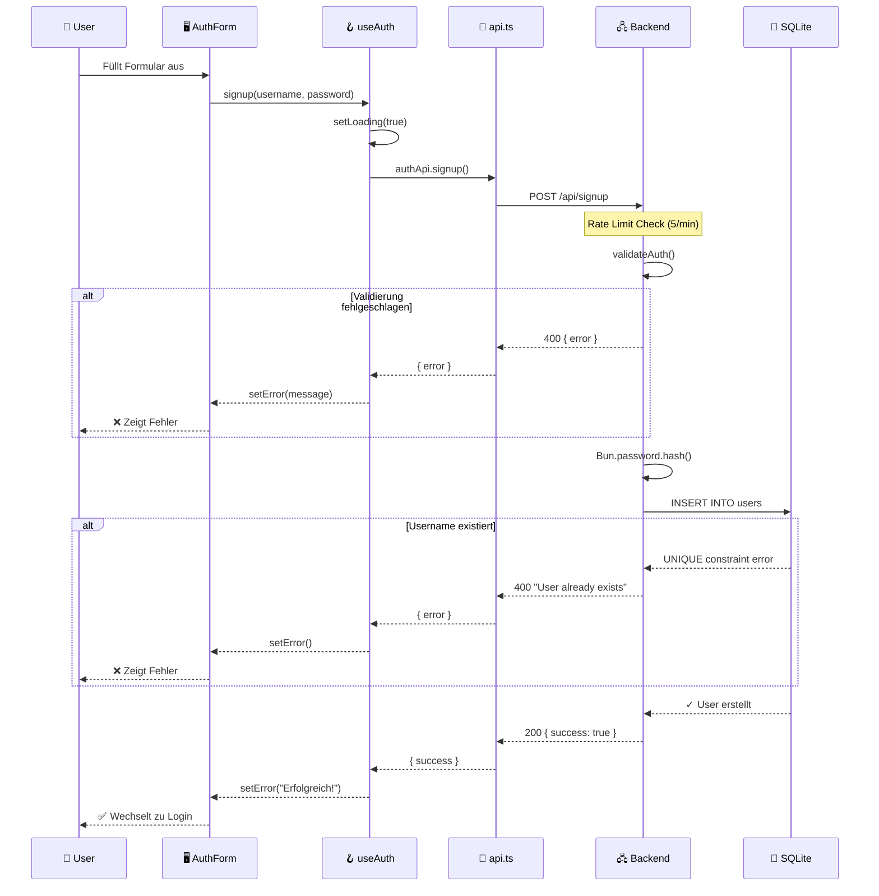
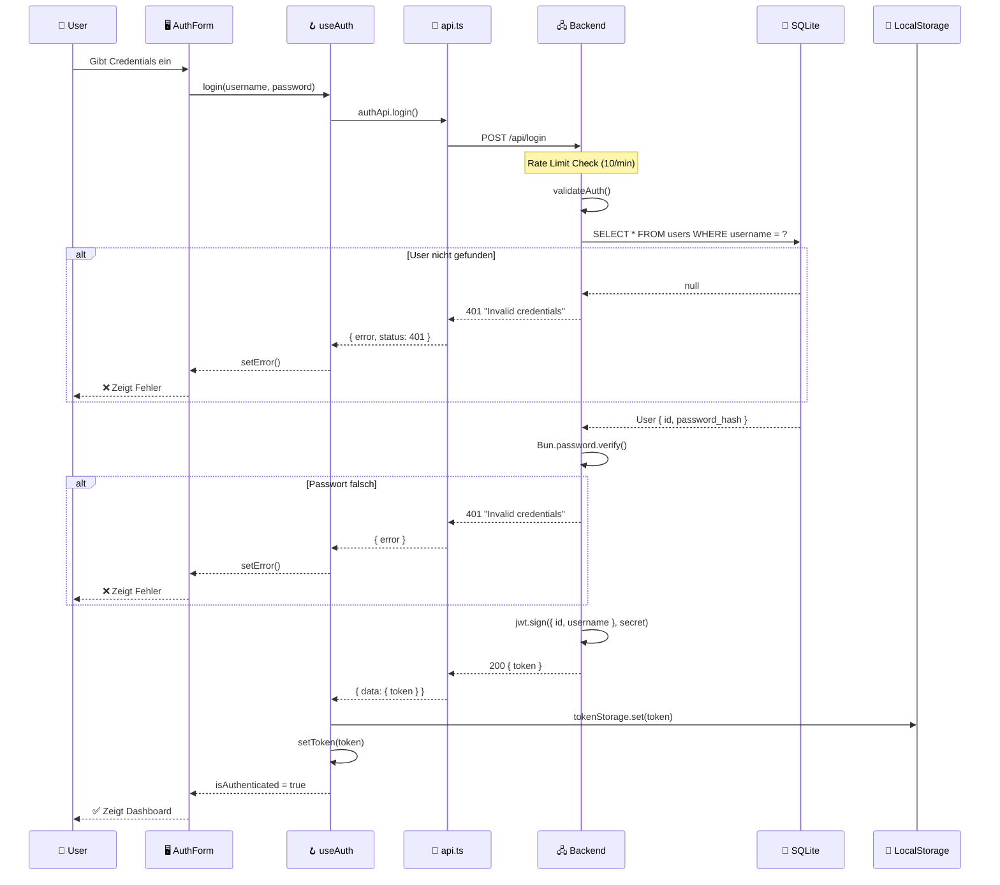
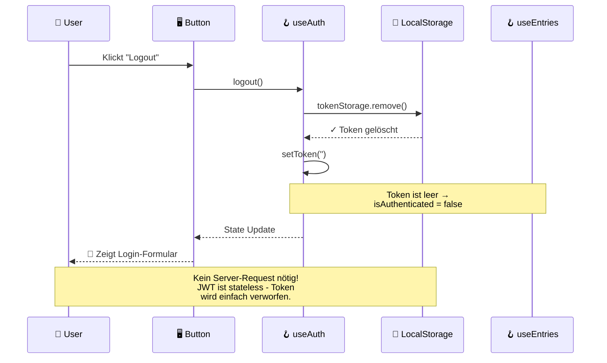
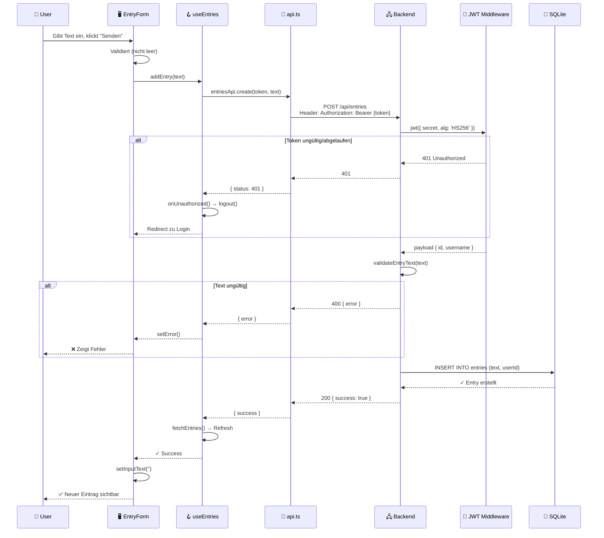
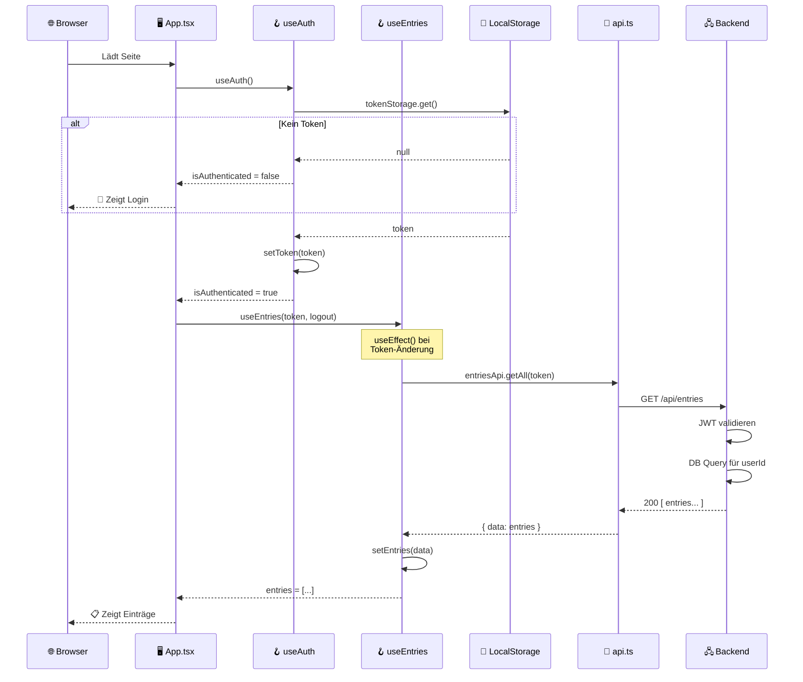
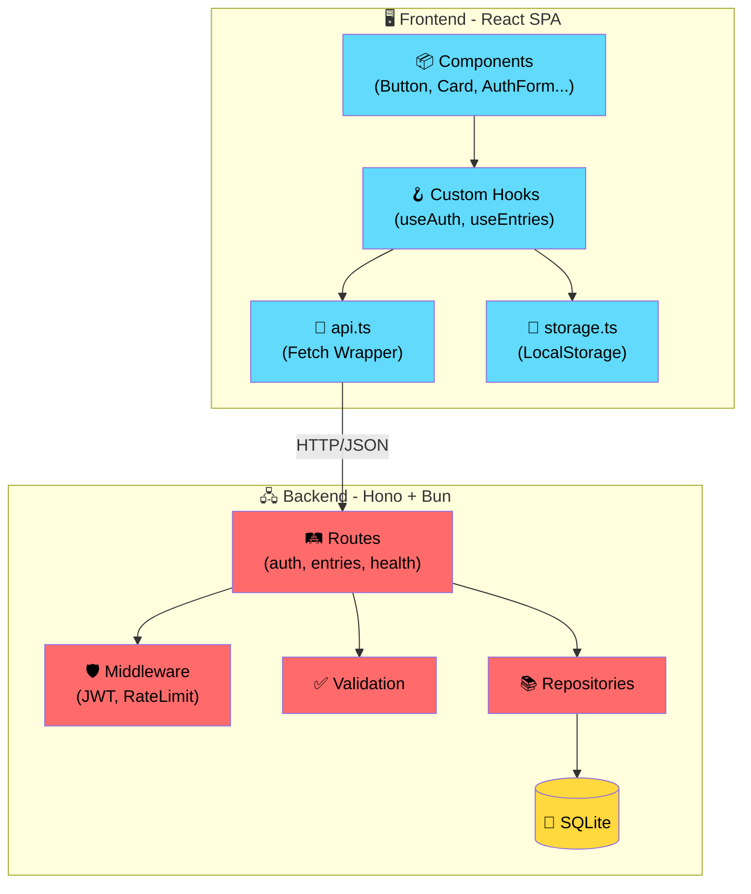

# ⚡ Low-RAM Fullstack Stack (Bun + Hono + React + SQLite)

Ein extrem ressourceneffizientes Web-App-Template, optimiert für den Betrieb auf schwachen VPS (Virtual Private Servern) mit minimalem RAM-Verbrauch (< 100MB im Idle).

## 🚀 Technologie-Stack

### Backend
- **Runtime:** [Bun](https://bun.sh/) - Extrem schneller JavaScript-All-in-One-Runtime.
- **Framework:** [Hono](https://hono.dev/) - Ultrafast, web-standardsbasiertes Framework.
- **Database:** `bun:sqlite` - Native SQLite-Anbindung ohne schwere ORMs oder externe Prozesse.
- **Auth:** `hono/jwt` Middleware & `Bun.password` für sicheres Argon2/bcrypt Hashing.

### Frontend
- **Framework:** [React 19](https://react.dev/) (SPA) - Als statische Dateien serviert.
- **Build-Tool:** [Vite](https://vitejs.dev/) - Schnelle Development-Experience und optimierte Builds.
- **PWA:** [vite-plugin-pwa](https://vite-pwa-org.netlify.app/) - Offline-Support und Installierbarkeit.
- **CSS:** [Tailwind CSS v4](https://tailwindcss.com/) - Modernstes CSS-Framework ohne Runtime-Overhead.

---

## 📁 Projekt-Struktur

```
/
├── backend/
│   ├── index.ts           # Haupteinstiegspunkt (App-Setup, Static Serving)
│   ├── db/
│   │   └── index.ts       # Datenbankverbindung & Repositories
│   ├── middleware/
│   │   ├── index.ts       # Middleware-Exports
│   │   └── rateLimit.ts   # Rate-Limiting Middleware
│   ├── routes/
│   │   ├── index.ts       # Route-Exports
│   │   ├── auth.ts        # Authentifizierungs-Routen (Login, Signup)
│   │   ├── entries.ts     # Einträge-Routen (CRUD)
│   │   └── health.ts      # Health-Check-Route
│   ├── types/
│   │   └── index.ts       # TypeScript Type-Definitionen
│   └── validation/
│       └── index.ts       # Eingabe-Validierungsfunktionen
│
├── frontend/
│   ├── src/
│   │   ├── App.tsx        # Haupt-App-Komponente
│   │   ├── main.tsx       # React-Einstiegspunkt
│   │   ├── index.css      # Globale Styles (Tailwind)
│   │   ├── components/
│   │   │   ├── index.ts   # Komponenten-Barrel-Export
│   │   │   ├── ui/        # Wiederverwendbare UI-Komponenten
│   │   │   │   ├── Alert.tsx
│   │   │   │   ├── Button.tsx
│   │   │   │   ├── Card.tsx
│   │   │   │   └── Input.tsx
│   │   │   ├── auth/      # Authentifizierungs-Komponenten
│   │   │   │   └── AuthForm.tsx
│   │   │   ├── entries/   # Einträge-Komponenten
│   │   │   │   ├── EntryForm.tsx
│   │   │   │   └── EntryList.tsx
│   │   │   └── layout/    # Layout-Komponenten
│   │   │       └── PageLayout.tsx
│   │   ├── hooks/         # Custom React Hooks
│   │   │   ├── index.ts
│   │   │   ├── useAuth.ts
│   │   │   └── useEntries.ts
│   │   ├── lib/           # Hilfsfunktionen & API-Client
│   │   │   ├── api.ts     # Zentralisierter API-Client
│   │   │   └── storage.ts # LocalStorage-Wrapper
│   │   └── types/         # TypeScript Type-Definitionen
│   │       └── index.ts
│   └── vite.config.ts
│
└── dist/                  # Build-Output (vom Backend serviert)
```

---

## 🏗️ Architektur

Das Projekt ist in eine klare Trennung von Frontend und Backend unterteilt, wobei das Backend zur Produktionszeit als Single-Server fungiert:

- **`/frontend`**: Der Quellcode der React-App. Während der Entwicklung läuft hier Vite als Dev-Server.
- **`/backend`**: Die API-Logik und DB-Anbindung.
- **`/dist`**: Der Build-Output des Frontends. Das Backend serviert diesen Ordner statisch auf der Root-Route (`/`).

### 🧩 Frontend-Architektur

Das Frontend folgt einer klaren Schichtenarchitektur:

| Schicht | Zweck | Beispiele |
|---------|-------|-----------|
| **Components** | UI-Darstellung | `Button`, `Card`, `AuthForm` |
| **Hooks** | Business-Logik & State | `useAuth`, `useEntries` |
| **Lib** | Infrastruktur | `api.ts`, `storage.ts` |
| **Types** | TypeScript-Definitionen | `Entry`, `User` |

### 🛠 Backend-Architektur

Das Backend ist modular aufgebaut:

| Modul | Zweck |
|-------|-------|
| **routes/** | HTTP-Endpunkte nach Domäne gruppiert |
| **middleware/** | Request-Processing (Rate Limiting) |
| **db/** | Datenbankzugriff & Repositories |
| **validation/** | Eingabe-Validierung |
| **types/** | Gemeinsame TypeScript-Definitionen |

### 📱 PWA Features
- **Offline-Caching**: Assets werden über Workbox gecacht.
- **Smart Updates**: Service Worker (`sw.js`) wird vom Backend mit `Cache-Control: no-cache` serviert, um sofortige Updates zu ermöglichen.
- **SPA Fallback**: Das Backend leitet alle Navigationsanfragen (Deep Links) auf die `index.html` um, damit clientseitiges Routing offline funktioniert.

**Vorteile dieser Architektur:**
- **Zero-Downtime DB:** SQLite ist eine Datei, kein extra Dienst, der abstürzen kann.
- **Minimaler Footprint:** Bun kombiniert HTTP-Server, Paketmanager und Runtime in einer Binärdatei.
- **CPU-Effizienz:** Kein Server-Side-Rendering (SSR). Die CPU des VPS wird nur für API-Logik und Datei-Serving genutzt.
- **Wiederverwendbarkeit:** Modulare Komponenten, Hooks und API-Clients können leicht erweitert werden.

---

## 🛠️ Lokale Entwicklung

### Voraussetzungen
Stelle sicher, dass [Bun](https://bun.sh/) auf deinem System installiert ist.

### Setup
1. Repository klonen.
2. Abhängigkeiten installieren:
   ```bash
   # Im Root-Verzeichnis
   cd frontend && bun install
   cd ../backend && bun install
   ```
3. Umgebungsvariablen setzen:
   ```bash
   export JWT_SECRET="dein-sicheres-secret"
   ```

### Dev-Server starten
Nutze das zentrale Skript im Root-Verzeichnis:
```bash
# Im Root-Verzeichnis
bun run dev
```
- **Frontend:** `http://localhost:5173` (Vite mit Proxy zu API)
- **Backend:** `http://localhost:3000` (Hono API)

---

## 🚢 Deployment (VPS)

Dieses Projekt ist darauf ausgelegt, mit minimalem Aufwand auf einem Linux-Server zu laufen.

### 1. Build erstellen
Lokal ausführen:
```bash
cd frontend
bun run build
```
Dies erstellt den `/dist` Ordner im Root-Verzeichnis.

### 2. Dateien übertragen
Du musst **nur** folgende Ordner/Dateien auf deinen VPS kopieren (z.B. via SCP oder Git):
- `/backend` (enthält die Logic)
- `/dist` (enthält das fertige Frontend)
- `package.json` (im Root, falls du zentrale Scripte nutzt)

### 3. Server starten
Auf dem VPS im `backend`-Ordner:
```bash
cd backend
export JWT_SECRET="dein-sicheres-secret"
bun install --production
bun run index.ts
```
*Empfehlung: Nutze `pm2` oder ein `systemd` Service-File, um den Prozess im Hintergrund am Laufen zu halten.*

---

## 📊 Vor- und Nachteile

### Vorteile
1. **Performance:** Bun startet in Millisekunden. SQLite-Abfragen sind durch In-Memory-Caching von Bun extrem schnell.
2. **Kosten:** Läuft stabil auf dem kleinsten $2-4 VPS von Hetzner, DigitalOcean oder Netcup.
3. **Einfachheit:** Kein Docker-Zwang, kein komplexes Setup von Datenbank-Clustern notwendig.
4. **Wartbarkeit:** Modulare Struktur ermöglicht einfaches Erweitern und Testen.

### Nachteile
1. **Vertikale Skalierung:** SQLite ist für sehr hohen Schreibzugriff (Tausende pro Sekunde) weniger geeignet als Postgres (wobei WAL-Mode hier viel hilft).
2. **Persistence:** Da die DB eine Datei ist, müssen Backups (Snapshots der `.sqlite`-Datei) selbst verwaltet werden.

---

## 🔒 Sicherheit
- Die App nutzt **JWT (JSON Web Tokens)** zur Authentifizierung.
- Passwörter werden niemals im Klartext gespeichert, sondern mit dem nativen **Bun Password Hashing** (stark gesalzen) verarbeitet.
- API-Routen unter `/api/entries/*` sind durch eine Middleware geschützt.
- **Rate Limiting** schützt vor Brute-Force-Angriffen auf Login/Signup.

---

## � Programmabläufe (Flow Diagrams)

Die folgenden Diagramme zeigen die wichtigsten Abläufe in der Anwendung.

### 🔐 Registrierung (Signup)



### 🔑 Login



### 🚪 Logout



### 📝 Eintrag erstellen



### 📊 App-Start (Einträge laden)



### 🏛️ Architektur-Übersicht



---

## �📜 Lizenz
MIT
