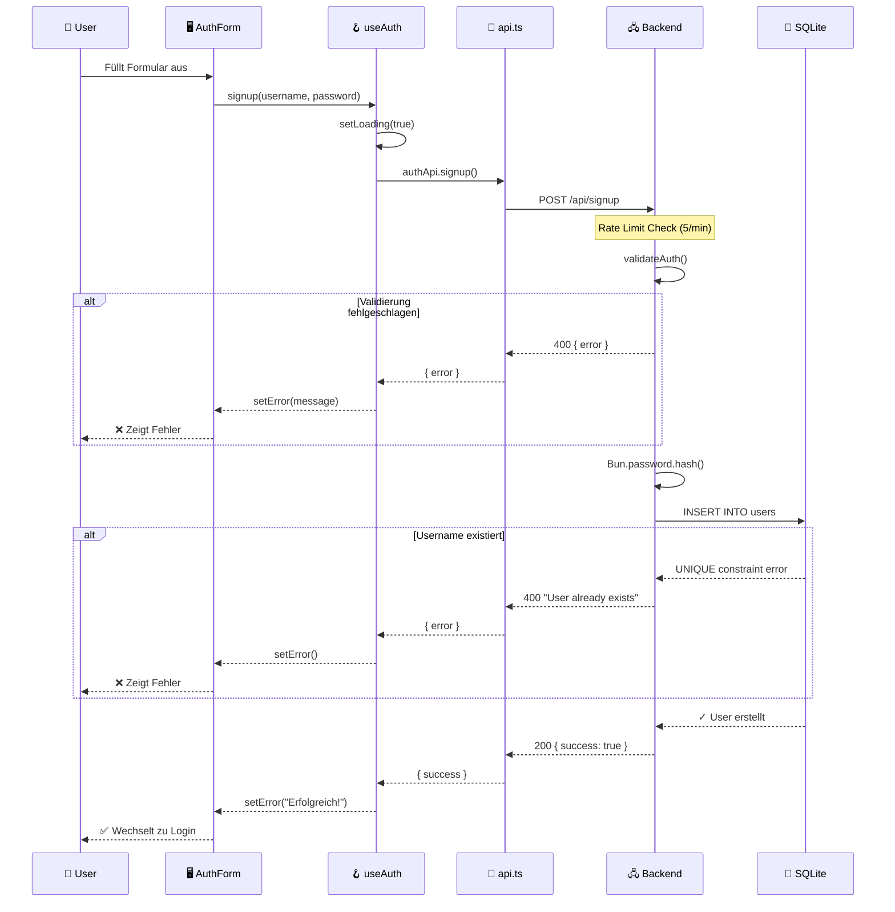
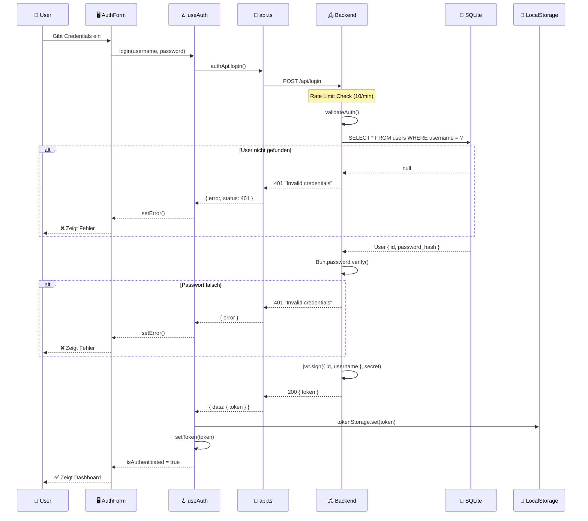
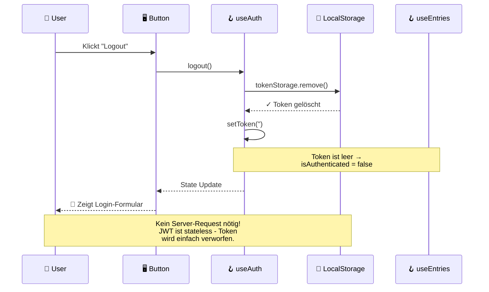
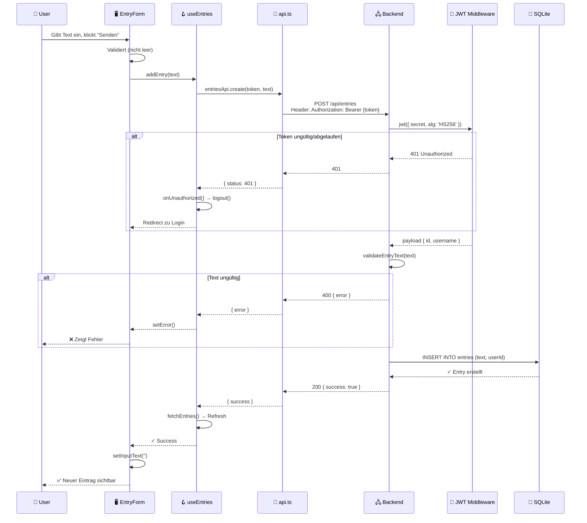
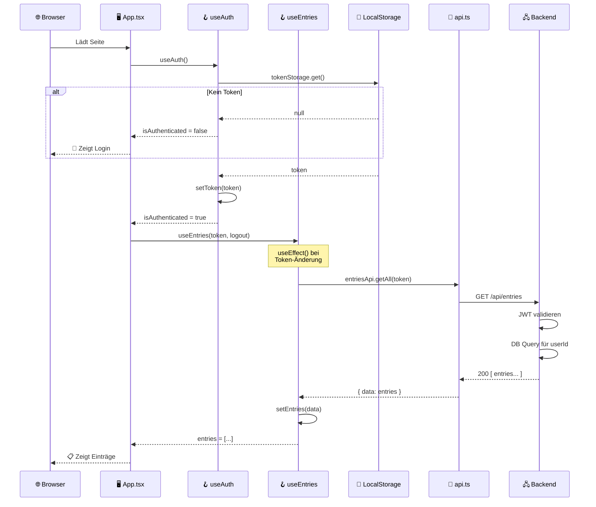
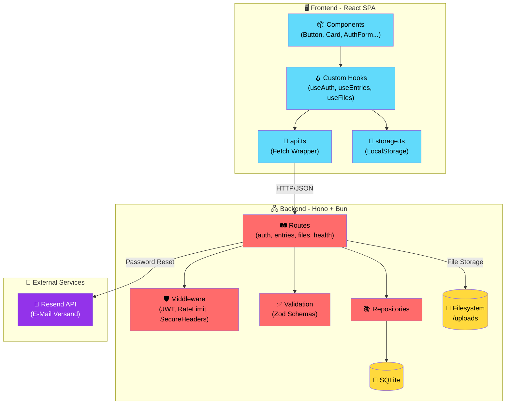
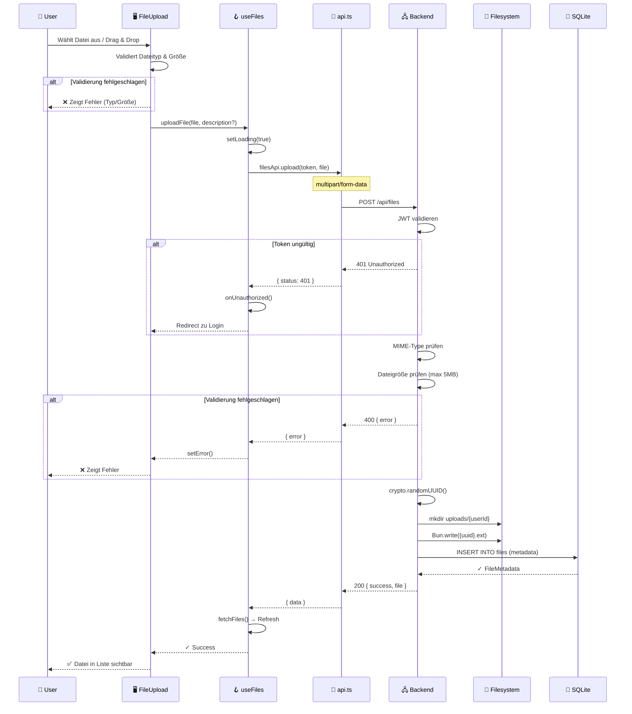
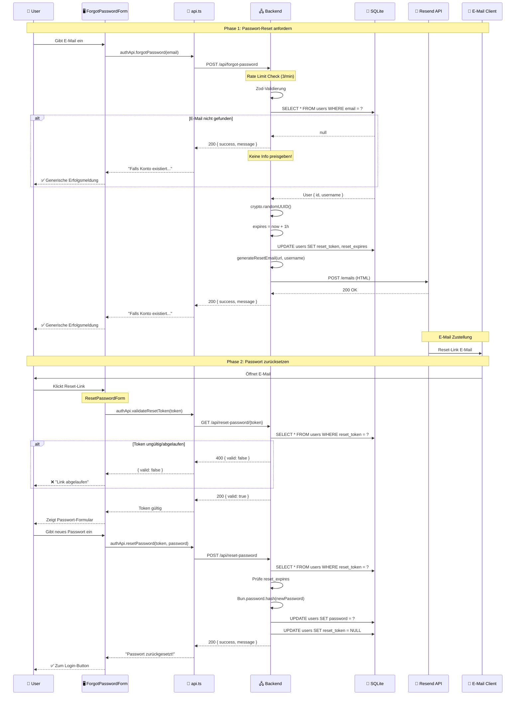

# ⚡ Low-RAM Fullstack Stack (Bun + Hono + React + SQLite)

Ein extrem ressourceneffizientes Web-App-Template, optimiert für den Betrieb auf schwachen VPS (Virtual Private Servern) mit minimalem RAM-Verbrauch (< 100MB im Idle).

## 🚀 Technologie-Stack

### Backend
- **Runtime:** [Bun](https://bun.sh/) - Extrem schneller JavaScript-All-in-One-Runtime.
- **Framework:** [Hono](https://hono.dev/) - Ultrafast, web-standardsbasiertes Framework.
- **Database:** `bun:sqlite` - Native SQLite-Anbindung ohne schwere ORMs oder externe Prozesse.
- **Auth:** `hono/jwt` Middleware & `Bun.password` für sicheres Argon2/bcrypt Hashing.
- **Validation:** [Zod](https://zod.dev/) + `@hono/zod-validator` - Typsichere Eingabe-Validierung.
- **Security:** `secureHeaders()` Middleware für XSS, HSTS, Clickjacking-Schutz.

### Frontend
- **Framework:** [React 19](https://react.dev/) (SPA) - Als statische Dateien serviert.
- **Build-Tool:** [Vite](https://vitejs.dev/) - Schnelle Development-Experience und optimierte Builds.
- **PWA:** [vite-plugin-pwa](https://vite-pwa-org.netlify.app/) - Offline-Support und Installierbarkeit.
- **CSS:** [Tailwind CSS v4](https://tailwindcss.com/) - Modernstes CSS-Framework via `@tailwindcss/vite`.
- **Linting:** ESLint + Prettier - Konsistente Code-Formatierung.

---

## 📁 Projekt-Struktur

```
/
├── backend/
│   ├── index.ts           # Haupteinstiegspunkt (App-Setup, Static Serving, Security Headers)
│   ├── db/
│   │   └── index.ts       # Datenbankverbindung & Repositories
│   ├── middleware/
│   │   ├── index.ts       # Middleware-Exports
│   │   └── rateLimit.ts   # Rate-Limiting Middleware
│   ├── routes/
│   │   ├── index.ts       # Route-Exports
│   │   ├── auth.ts        # Authentifizierungs-Routen (Login, Signup) mit Zod-Validierung
│   │   ├── entries.ts     # Einträge-Routen (CRUD) mit Zod-Validierung
│   │   ├── files.ts       # Datei-Upload-Routen (Upload, Download, Delete)
│   │   └── health.ts      # Health-Check-Route
│   ├── types/
│   │   └── index.ts       # TypeScript Type-Definitionen
│   └── validation/
│       ├── index.ts       # Eingabe-Validierungsfunktionen
│       └── schemas.ts     # Zod-Schemas für API-Validierung
│
├── frontend/
│   ├── src/
│   │   ├── App.tsx        # Haupt-App-Komponente mit Tab-Navigation
│   │   ├── main.tsx       # React-Einstiegspunkt
│   │   ├── index.css      # Globale Styles (Tailwind)
│   │   ├── components/
│   │   │   ├── index.ts   # Komponenten-Barrel-Export
│   │   │   ├── ui/        # Wiederverwendbare UI-Komponenten
│   │   │   │   ├── Alert.tsx
│   │   │   │   ├── Button.tsx
│   │   │   │   ├── Card.tsx
│   │   │   │   └── Input.tsx
│   │   │   ├── auth/      # Authentifizierungs-Komponenten
│   │   │   │   └── AuthForm.tsx
│   │   │   ├── entries/   # Einträge-Komponenten
│   │   │   │   ├── EntryForm.tsx
│   │   │   │   └── EntryList.tsx
│   │   │   ├── files/     # Datei-Upload-Komponenten
│   │   │   │   ├── FileUpload.tsx
│   │   │   │   └── FileList.tsx
│   │   │   └── layout/    # Layout-Komponenten
│   │   │       └── PageLayout.tsx
│   │   ├── hooks/         # Custom React Hooks
│   │   │   ├── index.ts
│   │   │   ├── useAuth.ts
│   │   │   ├── useEntries.ts
│   │   │   └── useFiles.ts
│   │   ├── lib/           # Hilfsfunktionen & API-Client
│   │   │   ├── api.ts     # Zentralisierter API-Client
│   │   │   └── storage.ts # LocalStorage-Wrapper
│   │   └── types/         # TypeScript Type-Definitionen
│   │       └── index.ts
│   ├── vite.config.ts
│   └── eslint.config.js   # ESLint + Prettier Konfiguration
│
├── .prettierrc            # Prettier Konfiguration
└── dist/                  # Build-Output (vom Backend serviert)
```

---

## 🏗️ Architektur

Das Projekt ist in eine klare Trennung von Frontend und Backend unterteilt, wobei das Backend zur Produktionszeit als Single-Server fungiert:

- **`/frontend`**: Der Quellcode der React-App. Während der Entwicklung läuft hier Vite als Dev-Server.
- **`/backend`**: Die API-Logik und DB-Anbindung.
- **`/dist`**: Der Build-Output des Frontends. Das Backend serviert diesen Ordner statisch auf der Root-Route (`/`).

### 🧩 Frontend-Architektur

Das Frontend folgt einer klaren Schichtenarchitektur:

| Schicht | Zweck | Beispiele |
|---------|-------|-----------|
| **Components** | UI-Darstellung | `Button`, `Card`, `AuthForm` |
| **Hooks** | Business-Logik & State | `useAuth`, `useEntries` |
| **Lib** | Infrastruktur | `api.ts`, `storage.ts` |
| **Types** | TypeScript-Definitionen | `Entry`, `User` |

### 🛠 Backend-Architektur

Das Backend ist modular aufgebaut:

| Modul | Zweck |
|-------|-------|
| **routes/** | HTTP-Endpunkte nach Domäne gruppiert |
| **middleware/** | Request-Processing (Rate Limiting) |
| **db/** | Datenbankzugriff & Repositories |
| **validation/** | Eingabe-Validierung |
| **types/** | Gemeinsame TypeScript-Definitionen |

### 📱 PWA Features
- **Offline-Caching**: Assets werden über Workbox gecacht.
- **Smart Updates**: Service Worker (`sw.js`) wird vom Backend mit `Cache-Control: no-cache` serviert, um sofortige Updates zu ermöglichen.
- **SPA Fallback**: Das Backend leitet alle Navigationsanfragen (Deep Links) auf die `index.html` um, damit clientseitiges Routing offline funktioniert.

**Vorteile dieser Architektur:**
- **Zero-Downtime DB:** SQLite ist eine Datei, kein extra Dienst, der abstürzen kann.
- **Minimaler Footprint:** Bun kombiniert HTTP-Server, Paketmanager und Runtime in einer Binärdatei.
- **CPU-Effizienz:** Kein Server-Side-Rendering (SSR). Die CPU des VPS wird nur für API-Logik und Datei-Serving genutzt.
- **Wiederverwendbarkeit:** Modulare Komponenten, Hooks und API-Clients können leicht erweitert werden.

---

## 🛠️ Development

### Voraussetzungen
- [Bun](https://bun.sh/) (v1.0+)

### Setup
```bash
# Im Root-Verzeichnis
cd frontend && bun install
cd ../backend && bun install
cd ..
bun install  # Root-Dependencies (Prettier)
```

### Umgebungsvariablen
```bash
export JWT_SECRET="dein-sicheres-secret"
```

### Dev-Server starten
```bash
bun run dev
```
- **Frontend:** `http://localhost:5173` (Vite mit Proxy zu API)
- **Backend:** `http://localhost:3000` (Hono API)

### Verfügbare Scripts
| Script | Beschreibung |
|--------|--------------|
| `bun run dev` | Frontend + Backend gleichzeitig starten |
| `bun run dev:frontend` | Nur Vite Dev-Server |
| `bun run dev:backend` | Nur Backend mit Watch-Mode |
| `bun run build:frontend` | Frontend für Produktion bauen |
| `bun run lint` | ESLint ausführen |
| `bun run format` | Code mit Prettier formatieren |
| `bun run format:check` | Prüfen ob Code formatiert ist |

---

## 📦 Deployment (VPS)

Dieses Projekt ist darauf ausgelegt, mit minimalem Aufwand auf einem Linux-Server zu laufen.

### 1. Build erstellen
```bash
bun run build:frontend
```

### 2. Dateien übertragen
Nur diese Ordner/Dateien auf den VPS kopieren:
- `/backend`
- `/dist`

### 3. Umgebungsvariablen konfigurieren

Erstelle eine `.env` Datei im `backend/` Ordner:

```bash
# Pflicht: JWT Secret für Token-Signierung
JWT_SECRET=dein-sicheres-secret-hier

# Für Passwort-Reset Funktion (optional aber empfohlen)
RESEND_API_KEY=re_xxxxxxxxxxxx
EMAIL_FROM=noreply@deine-domain.de
APP_URL=https://deine-domain.de
```

### 4. Server starten
```bash
cd backend
bun install --production
bun run index.ts
```
*Empfehlung: Nutze `pm2` oder `systemd` für Prozess-Management.*

---

## 📧 E-Mail Setup (Resend)

Die Passwort-vergessen-Funktion verwendet [Resend](https://resend.com) für den E-Mail-Versand. Resend ist ein moderner E-Mail-Dienst mit großzügigem Free-Tier (3.000 E-Mails/Monat).

### Warum Resend?

| Vorteil | Beschreibung |
|---------|--------------|
| **Kein SMTP-Server** | Keine eigene Mail-Infrastruktur nötig |
| **Minimaler RAM** | Nur eine HTTP-Anfrage, Resend übernimmt Queueing |
| **Hohe Zustellrate** | Professionelle Infrastruktur, weniger Spam-Probleme |
| **Einfache API** | Native `fetch()` von Bun, kein nodemailer |

### 1. Resend Account erstellen

1. Gehe zu [resend.com/signup](https://resend.com/signup)
2. Erstelle einen Account (kostenlos)
3. Im Dashboard: **API Keys** → **Create API Key**
4. Kopiere den Key (beginnt mit `re_`)

### 2. Domain verifizieren (WICHTIG!)

Ohne Domain-Verifizierung landen E-Mails im Spam oder werden abgelehnt.

1. Im Resend Dashboard: **Domains** → **Add Domain**
2. Gib deine Domain ein (z.B. `deine-domain.de`)
3. Füge die angezeigten DNS-Einträge bei deinem Domain-Provider hinzu:

| Typ | Name | Wert |
|-----|------|------|
| **TXT** | `resend._domainkey` | `p=MIGf...` (Resend zeigt den vollständigen Wert) |
| **TXT** | `@` oder `_dmarc` | `v=DMARC1; p=none;` |
| **CNAME** | `send` | `send.resend.com` |

**Beispiel für Cloudflare/Hetzner DNS:**
```
# SPF Record (falls nicht vorhanden)
TXT  @                    "v=spf1 include:_spf.resend.com ~all"

# DKIM Record
TXT  resend._domainkey    "p=MIGf..."

# DMARC Record
TXT  _dmarc               "v=DMARC1; p=none;"
```

4. Warte auf Verifizierung (kann bis zu 24h dauern, meist schneller)
5. Status sollte auf "Verified" wechseln ✅

### 3. Umgebungsvariablen setzen

```bash
# backend/.env
RESEND_API_KEY=re_123456789abcdef
EMAIL_FROM=noreply@deine-domain.de
APP_URL=https://deine-domain.de
```

**Wichtig:**
- `EMAIL_FROM` muss eine Adresse deiner verifizierten Domain sein
- `APP_URL` wird für den Reset-Link in der E-Mail verwendet
- Ohne `APP_URL` wird `http://localhost:5173` als Fallback genutzt

### 4. Testen

```bash
# Backend starten
cd backend
export RESEND_API_KEY=re_xxx
export EMAIL_FROM=noreply@deine-domain.de
export APP_URL=http://localhost:5173
bun run index.ts

# Test-Request (in neuem Terminal)
curl -X POST http://localhost:3000/api/forgot-password \
  -H "Content-Type: application/json" \
  -d '{"email":"deine@email.de"}'
```

### Troubleshooting

| Problem | Lösung |
|---------|--------|
| E-Mail kommt nicht an | DNS-Einträge prüfen, Spam-Ordner checken |
| `RESEND_API_KEY not configured` | `.env` Datei erstellen oder `export` verwenden |
| `Invalid API Key` | Key im Resend Dashboard neu generieren |
| E-Mail im Spam | Domain vollständig verifizieren (SPF, DKIM, DMARC) |

---

## 🔧 Code-Qualität

### ESLint
Das Projekt verwendet ESLint mit:
- TypeScript-Support (`typescript-eslint`)
- React Hooks Rules (`eslint-plugin-react-hooks`)
- React Refresh (`eslint-plugin-react-refresh`)
- Prettier-Kompatibilität (`eslint-config-prettier`)

### Prettier
Konfiguriert in `.prettierrc`:
- Keine Semikolons
- Single Quotes
- 2 Spaces Einrückung
- 100 Zeichen Zeilenlänge

**Empfehlung:** Beide Tools sollten in der CI/CD Pipeline verwendet werden:
```bash
bun run lint && bun run format:check
```

---

## 📊 Programmabläufe (Flow Diagrams)

### Authentifizierung
- **JWT (JSON Web Tokens)** mit HS256-Algorithmus und 24h Ablaufzeit.
- Passwörter werden mit **Bun.password** (Argon2/bcrypt) sicher gehasht.
- Rate Limiting schützt Login (10/min) und Signup (5/min) vor Brute-Force.

### Eingabe-Validierung
- **Zod-Schemas** validieren alle API-Eingaben mit `@hono/zod-validator`.
- Strikte Typ-Validierung für Username, Passwort, Entry-Text und Datei-Uploads.

### SQL-Injection-Schutz ✅
- **Alle** Datenbankabfragen verwenden **Prepared Statements** mit `?`-Platzhaltern.
- Werte werden nie direkt in SQL-Strings konkateniert.
- Beispiel: `db.query('SELECT * FROM users WHERE username = ?').get(username)`

### Security Headers
Die `secureHeaders()` Middleware aktiviert:
- `X-XSS-Protection: 1; mode=block`
- `X-Content-Type-Options: nosniff`
- `X-Frame-Options: SAMEORIGIN` (Clickjacking-Schutz)
- `Strict-Transport-Security` (HSTS)
- `Referrer-Policy: strict-origin-when-cross-origin`

### Datei-Uploads
- Erlaubte MIME-Types: Bilder (JPG, PNG, GIF, WebP), PDF, TXT, CSV.
- Maximale Dateigröße: 5 MB.
- Dateien werden mit UUID umbenannt (verhindert Path-Traversal).
- User können nur eigene Dateien sehen/löschen.

---

## 🛠️ Development

Die folgenden Diagramme zeigen die wichtigsten Abläufe in der Anwendung.

### 🔐 Registrierung (Signup)



### 🔑 Login



### 🚪 Logout



### 📝 Eintrag erstellen



### 📊 App-Start (Einträge laden)



### 🏛️ Architektur-Übersicht



### 📁 Datei-Upload



### 🔐 Passwort vergessen & zurücksetzen



---

## �📜 Lizenz
MIT
